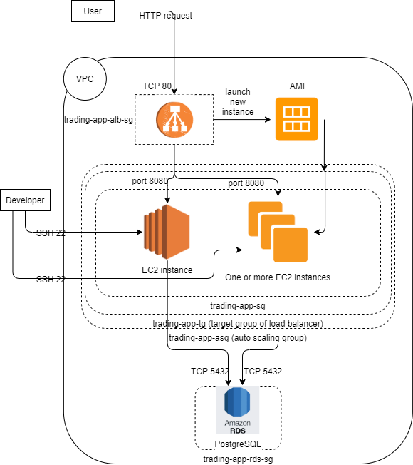
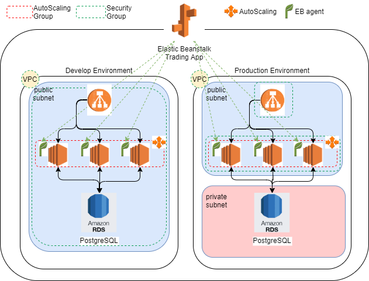
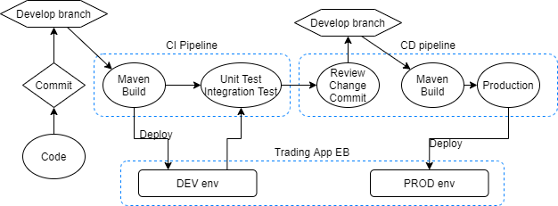

# Cloud DevOps
* [Introduction](#introduction)
* [Cloud Application Architecture](#cloud-application-architecture)
* [Deployment Environments](#deployment-environments)
* [Jenkins](#jenkins)
* [Potential Improvements](#potential-improvements)

# Introduction

This application used in this project is the trading platform developed in the SpringBoot project. It uses three-tier architecture where data tier stores information, the application tier handles logic and the presentation tier is a graphical user interface. The three tiers are logical, not physical, and may or may not run on the same physical server. The application implements microservice design pattern to make it more scalable and easier to maintain. In this project, the application is deployed using amazon web service. EC2 instance is used to contain the application tier and RDS database is for the data tier. The client will then be able to access the trading platform with an endpoint. Moreover, the application is also deployed with load balancer and elastic beanstalk which make it able to handle large traffic. Jenkins CI/CD pipeline is also created to make the development/deployment process easier. 

# Cloud Application Architecture

In this project, multiple amazon web services are leveraged and studied:
- Virtual Private Cloud (public subnet only & public subnet + private subnet): Enclose AWS created
    - ACL (internet access control list), Route Table, Internet Gateway
- EC2 (compute engine)
    - AMI: EC2 instance image
- RDS (database)
    - Snapshot: Database instance image 
- Security Group: Inbound and Outbound rule group
- Application Load Balancer: Can start new EC2 instance when  incoming traffic becomes larger
- Target Group: Group of EC2 instance managed by ALB
- Auto Scaling group: Group where the EC2 instance created by ALB goes
- Cloudformation: Debug stack creation error.
- Elastic Beanstalk: Deployment tool

Below is a diagram illustrating the cloud application architecture using ALB.

### Advantage of using ALB
By using an application load balancer, a new EC2 instance will be instantiated by ALB from the AMI image provided when the incoming traffic becomes larger than a configured threshold. Then, the ALB can route the requests to all the EC2 instances available to improve performance. Also, the ALB will send health requests to each EC2 instance it manages. If there is no response or there are two unhealthy responses consecutively, the ALB will mark it as a failed instance, terminate it and start a new one. 

# Deployment Environments
Next, elastic beanstalk (EB) is leveraged to simplify the deployment process. In this trading application, two environments are created using EB: development and production. Develop an environment is where testing happens and the production environment is the one that is published. To create an application, only the application is required. For a single application, it can have multiple environments (configurations). For both dev and prod env in this application, they are configured to have a load balancer that can launch three EC2 instances (spanning three regions in Central Canada) at most. Also, both endpoints are available at port 8080 which is the port that swagger UI is listening on. The detail of deployment using EB is shown in the following diagram.

For EB, a newer version can be deployed by simply uploading the zip file containing the application. The environment will be updated after the newer version is deployed. However, there are still lots of manual work like maven packaging and uploading the application. The next session will introduce a more automated approach. 

# Jenkins 

## Jenkins Server
To further simplify the deployment process, a tool called Jenkins is leveraged. It is an automated project build and deployment tool which can connect to GitHub and check for update constantly. The build and deployment process is specified by the JenkinsFile located in the project and it can be scheduled either periodically or in the presence of available updates. In this project, the develop branch and master branch are used for deployment in DEV env and PROD env described in the previous session. The details of the Jenkins server is illustrated in the following diagram.

As shown above, NGINX is in charge of routing the request to the servers by the reverse proxy. In this project, the Jenkins server lies in between NGINX and other underlying servers. The NGINX will route the requests to Jenkins server and Jenkins will communicate with underlying servers through port 8080. 

## Jenkins CI/CD pipeline
The CI/CD pipeline in Jenkins is built using JenkinsFile. It can be found under the root directory of the Springboot project. JenkinsFile is responsible for deploying code in develop branch into DEV env and deploying code in the master branch into PROD env. It will call the eb_deploy shell script located in the script/eb folder to initialize and deploy the application. More env deployment can be added by inserting more stages in the JenkinsFile for other test purposes.
The overall pipeline is illustrated in the below diagram.

# Potential Improvements
1. Create a more strict security group only allowing SSH from the developer's IP address.
2. Use IAM to grant access for a potential quality analyst or others with specific goals who should not have full access to all services.
3. Add more function to the application to let it add the schema to the database (skip if schema exists) automatically when the application is started.
