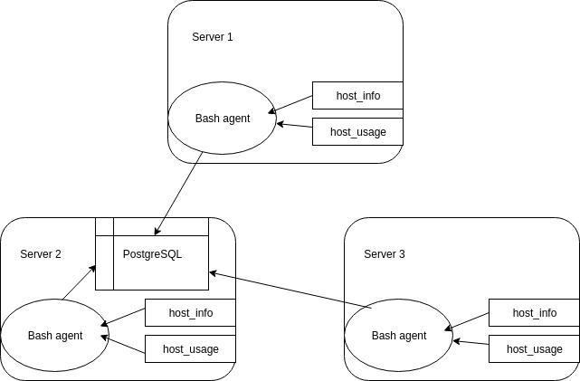

# Linux Cluster Monitoring Agent

## Introduction
Cluster Monitor Agent is an internal tool that monitors the cluster resources and save the collected information into a database for furture use. This helps the infrastrue team to monitor the efficiency and hardware status of each server. In case that something went wrong, the infrasture team can inspect the usage information collected to indentify the problem.

## Architecture and Design 
1) Below is a Architecture diagram for this project 



2) It will setup a database called host_agent that consists of 2 table: host_info and host_usage. "host_info" table includes all the hardware specification and its hostname along with a id assigned to each host. "host_info" table includes the usage of CPU, memory, and disk for a certain host (identified by host id) at a certain time.
3) The script usage in this project will be explained below:
	* `psql_docker.sh`: This script will setup the PostgreSQL database using docker.
	* `ddl.sql`: This script will setup the database and table described above.
	* `host_info.sh`: This script will collect hardware information and hostname from the host server and insert the data into the table created.
	* `host_usage.sh`: This script will collect the usage information about CPU, memory, and disk right after this script is executed and insert the data into the table created.
	* `queries.sql`: This script will select the cpu number, host id, and total memory from host_info table and list by cpu number in ascending order and total memory in descending order. Then, it will also calculate the average memory usage percentage for each host.

## Usage 
1) `psql_docker.sh` usage: There are 2 input option for this, start or stop. 
	* To start: `./psql_docker.sh start [password for default user]`
	* To stop: `./psql_docker.sh stop`
2) `ddl.sql` usage: `psql -h [hostname] -U [user name] -p [port number] -c "ddl.sql"`
3) `host_info.sh` usage: There are 4 input parameters required in correct order: [host name] [database name] [user name] [password for the user]
	* For example: `./host_info.sh hostname database_name user_name password`
4) `host_usage.sh` usage: Same as `host_info.sh` usage.
5) `queries.sql` usage: Same as ddl.sql.
	* For example: `psql -h [hostname] -U [user name] -p [port number] -c "ddl.sql"`
6) In order to collect the usage information every minute, use `crontab -e` and enter the following code:
		```* * * * * bash [path to host_usage.sh]/host_usage.sh "host name" "port number" "database name" "user name "password" >> [path to store log file]/host_usage.log```.
		Then, press `ESC` and enter `:wq` to exit. The script will be automatically running afterwards.

## Improvements 
1) Organize a single file to create/run the docker PostgreSQL and create table at once.
2) Add function to delete a certain host from both table.
3) Create a script that could set up the crontab itself.

